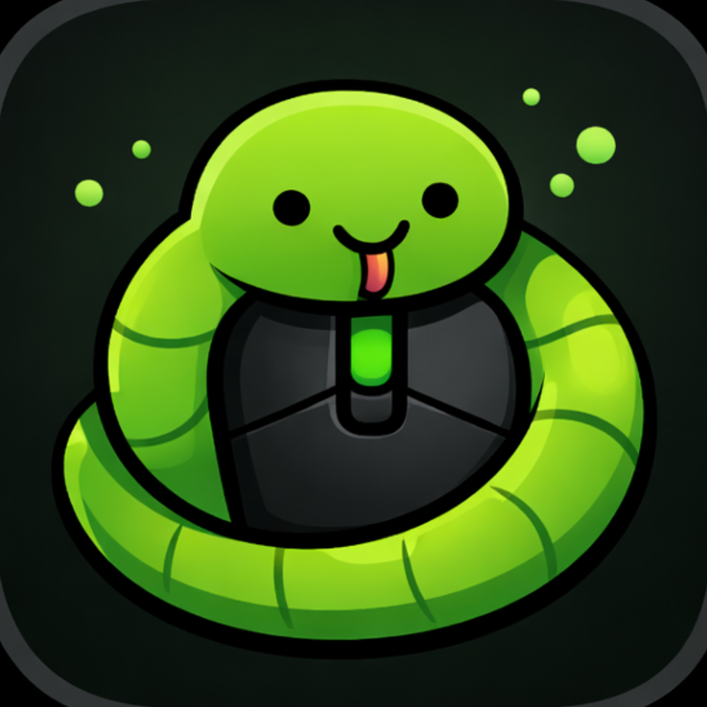

<p align="center">
  
</p>

<h1 align="center">Open Snek</h1>

<p align="center">
  Configure supported Razer mice on macOS without Synapse, Windows, or vendor lock-in.
</p>


Open Snek is an open source native macOS app for configuring supported Razer mice over USB or Bluetooth.

## Features

- Change DPI, stage count, and active stage
- Adjusts supported lighting settings
- Remaps supported buttons
- Works over USB and Bluetooth where the device protocol allows it
- Avoids the need for Synapse or a separate Windows machine

## Download and Install

1. Download the latest DMG from [GitHub Releases](https://github.com/gh123man/open-snek/releases).
2. Open the DMG.
3. Drag `Open Snek.app` into `Applications`.
4. Launch `Open Snek`.

If macOS asks for permissions:

- For USB control, grant `Input Monitoring` to `Open Snek` in `System Settings > Privacy & Security`.
- For Bluetooth control, allow Bluetooth access when prompted.

## Supported Devices

- Razer Basilisk V3 X HyperSpeed
  - USB PID `0x00B9`
  - Bluetooth PID `0x00BA` (VID `0x068E`)

This is the only supported device today because it has essentially no useful official Razer configuration support on macOS, and it was the original target for the project.

Support for more devices is welcome. New device support can land either through outside contributors or as more hardware becomes available for capture, testing, and validation.

## Build From Source

From the repo root:

```bash
./run.sh
```

That rebuilds and launches the app bundle through the canonical macOS path in `OpenSnek/scripts/run_macos_app.sh`.

If you want to reuse the current app bundle without rebuilding:

```bash
./run.sh --no-build
```

## Build

```bash
swift build --package-path OpenSnek
```

## Test

```bash
swift test --package-path OpenSnek
```

## Xcode

```bash
./OpenSnek/scripts/generate_xcodeproj.sh --open
```

## Project Docs

- App build, run, probe, and validation details: [OpenSnek/README.md](OpenSnek/README.md)
- Device support and reverse-engineering workflow: [CONTRIBUTING.md](CONTRIBUTING.md)
- DMG release and notarization setup: [docs/release/DMG_RELEASE.md](docs/release/DMG_RELEASE.md)
- Protocol documentation: [docs/protocol/PROTOCOL.md](docs/protocol/PROTOCOL.md)
- Supported Python tooling: [tools/python/README.md](tools/python/README.md)
- BLE capture corpus: [captures/README.md](captures/README.md)

## License

This repository is licensed under the Apache License 2.0. See [LICENSE](LICENSE).
